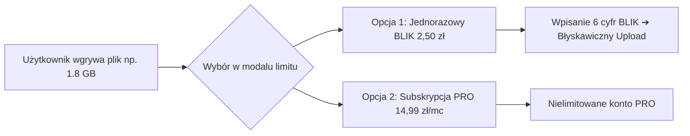
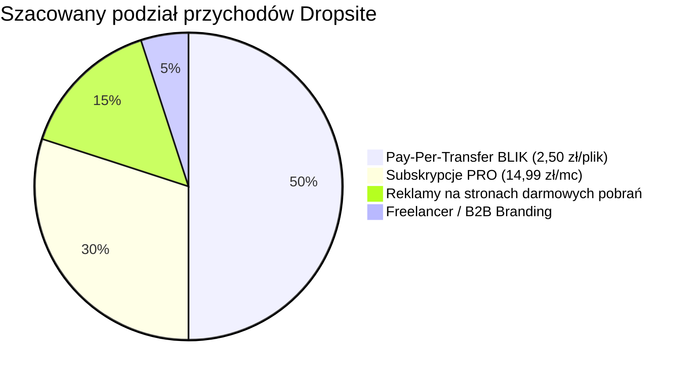

# 🚀 KOMPLEKSOWY MASTER PLAN MONETYZACJI: DROPSITE
**Projekt:** Dropsite — Prywatny i Szybki Transfer Plików (Micro-SaaS)  
**Model biznesowy:** Hybrydowy (Subskrypcje PRO + Pay-Per-Transfer BLIK + Reklamy)  
**Koszt stały infrastruktury:** **0 zł / miesiąc** (Cloudflare Pages + Workers + R2)  

---

## 📑 SPIS TREŚCI
1. [Status Projektu & Podsumowanie Postępów](#-status-projektu--podsumowanie-postępów)
2. [Etap 0: Architektura Bezpieczeństwa (Zero-Trust)](#-etap-0-architektura-bezpieczeństwa-zero-trust)
3. [Etap 1: Audyt UI/UX & Psychologia Konwersji (Triggery Zakupowe)](#-etap-1-audyt-uiux--psychologia-konwersji)
4. [Etap 2: Hosting i Domena (Cloudflare Pages + Własna Domena)](#-etap-2-hosting-i-domena)
5. [Etap 3: Wdrożenie Płatności & BLIK (Architektura)](#-etap-3-wdrożenie-płatności--blik)
6. [Etap 4: Modele Monetyzacji: Subskrypcja vs Pay-Per-Transfer BLIK](#-etap-4-modele-monetyzacji)
7. [Etap 5: Monetyzacja z Wyświetleń & Reklam (Model Hybrydowy)](#-etap-5-monetyzacja-z-wyświetleń--reklam)
8. [Etap 6: Kwestie Prawne i Podatkowe (Regulamin, RODO, Działalność Nierejestrowana)](#-etap-6-kwestie-prawne-i-podatkowe)
9. [Etap 7: Playbook Dystrybucji & Kampanie Marketingowe (Gotowe Posty i Haki)](#-etap-7-playbook-dystrybucji--kampanie-marketingowe)
10. [Etap 8: Ekonomia Jednostkowa i Prognoza Zysków](#-etap-8-ekonomia-jednostkowa-i-prognoza-zysków)
11. [📋 Checklista Przedstartowa (Pre-Launch Checklist)](#-checklista-przedstartowa-pre-launch-checklist)

---

## 📊 STATUS PROJEKTU & PODSUMOWANIE POSTĘPÓW

| Element | Status | Uwagi |
| :--- | :--- | :--- |
| **Rdzeń aplikacji (Upload/Download/Worker)** | ✅ Ukończone | Silnik R2, limity 250 MB / 10 GB, weryfikacja kluczy. |
| **Branding & Favicon** | ✅ Ukończone | Nowoczesna miętowo-ciemna estetyka, ikona wpięta w kod. |
| **Migracja na Cloudflare Pages** | ✅ Ukończone | 100% darmowy, komercyjny hosting bez limitu transferu. |
| **Konto Polar.sh (Produkt PRO)** | 🟡 W trakcie | Wstępnie skonfigurowane, przygotowanie pod integrację BLIK / EasyCart. |
| **Własna Domena (.pl / .app)** | ❌ Do zrobienia | Niezbędna do zaufania i płatności. |
| **Regulamin i Polityka Prywatności** | ❌ Do zrobienia | Wymóg prawny dla sprzedaży w PL/UE. |
| **Sloty Reklamowe (AdSense / EthicalAds)** | ❌ Do zrobienia | Przygotowanie konta i wdrożenie banerów dla darmowych pobrań. |
| **Kampania Startowa (Dystrybucja)** | ❌ Do zrobienia | Gotowe scenariusze postów (Wykop, FB, TikTok, Reddit). |

---

## 🛡️ ETAP 0: Architektura Bezpieczeństwa (Zero-Trust)

### Zrealizowano:
- [x] **Dedykowane środowisko Cloudflare**:
  - Konto e-mail: `dropsite33@gmail.com`.
  - Bucket Cloudflare R2: `dropsite-storage` z publicznym dostępem.
  - Worker `uploud-api` zoptymalizowany pod kątem bezpieczeństwa (brak XSS, nagłówki bezpieczeństwa, `nosniff`).
- [x] **Separacja usług:** Nowe, odizolowane konta bez powiązań z projektami prywatnymi.

### Do dopilnowania w konfiguracji Cloudflare:
1. **Bot Fight Mode:** Aktywne w panelu Cloudflare (ochrona przed scraperami i skryptami obciążającymi serwer).
2. **Environment Secrets:** Przechowywanie kluczy administracyjnych jako zmiennych zaszyfrowanych (Secrets) w Cloudflare Worker.

---

## 🎨 ETAP 1: Audyt UI/UX & Psychologia Konwersji

Mechanizmy konwersji wbudowane bezpośrednio w moment, w którym użytkownik napotyka limit darmowy:



### 🎯 Komunikaty w oknie konwersji (Modal Dropsite PRO):
* Gdy darmowy użytkownik upuści plik o wadze np. **1.8 GB (film z wakacji, zdjęcia z wesela)**:
  * **Nagłówek:** *„Ten plik ma 1.8 GB. Darmowy transfer obsługuje do 250 MB.”*
  * **Główny Call to Action (Impulsowy BLIK):**  
    👉 **[ ⚡ Wyślij ten jeden plik (do 5 GB) za 2,50 zł kodem BLIK ]**  
    *(Bez rejestracji, bez subskrypcji, transfer startuje natychmiast)*
  * **Drugorzędny Call to Action (Dla regularnych twórców):**  
    👉 *„Wysyłasz regularnie? [Odblokuj nielimitowane Dropsite PRO za 14,99 zł/mc]”*

---

## 🌐 ETAP 2: Hosting i Domena

### 1. Hosting (Cloudflare Pages) — ✅ ZREALIZOWANO
* Zero kosztów stałych, brak limitu pasma (Bandwidth).
* Zgodność z komercyjnym wykorzystaniem (w przeciwieństwie do Vercel Hobby).

### 2. Własna Domena (Krok do wykonania)
* **Rekomendacje:** `dropsite.pl` (dla rynku PL) lub `dropsite.app` (dla rynku globalnego).
* **Koszt:** ~12–15 zł brutto za pierwszy rok w Seohost / OVH.
* **Podpięcie:** Błyskawiczne przez Cloudflare DNS z darmowym certyfikatem SSL.

---

## 💳 ETAP 3: Wdrożenie Płatności & BLIK

Dla polskiego użytkownika **BLIK to bezwzględny król konwersji** (zwłaszcza przy mikropłatnościach 2,50 zł).

### Ścieżki wdrożenia BLIK:
1. **Ścieżka Szybka (Polar.sh / Stripe):**
   * Polar.sh obsługuje karty, Apple Pay, Google Pay i metody Stripe w PLN.
   * Zaleta: Automatyczne generowanie licencji i zero problemów z VAT.
2. **Ścieżka Dedykowana pod Polski Rynek (EasyCart.pl):**
   * Prawdziwy, natywny BLIK (klient wpisuje 6 cyfr w okienku na stronie).
   * Idealny pod model mikropłatności `2,50 zł za 1 plik`.

---

## 💡 ETAP 4: Modele Monetyzacji (Miks Przychodów)



### 1. "Pay-Per-Transfer" BLIK (2,50 PLN jednorazowo) — GŁÓWNY MOTOR NAPĘDOWY
* **Sytuacja życiowa klienta:** *Gdy ktoś raz na jakiś czas musi pilnie wysłać film z wakacji (2 GB), paczkę zdjęć z wesela czy projekt dla klienta.*
* **Dlaczego to działa:** Taki użytkownik **nigdy** nie kupi miesięcznego abonamentu za 15 zł, bo potrzebuje wysłać tylko ten jeden plik tu i teraz. Ale 2,50 zł kodem BLIK zapłaci bez wahania.
* **Parametry oferty:**
  * Plik do 5 GB.
  * Czas przechowywania: 7 dni.
  * Brak reklam na stronie pobierania dla odbiorcy.

### 2. Subskrypcja Dropsite PRO (14,99 PLN / miesiąc)
* **Dla kogo:** Montażyści wideo, fotografowie, graficy, agencje, programiści.
* **Korzyści:**
  * Paczki do 10 GB bez limitu ilości transferów.
  * Czas przechowywania: 30 dni lub bezterminowo.
  * Własny alias linku (np. `dropsite.pl/wesele-ani-i-tomasza`).
  * Ochrona hasłem i powiadomienia e-mail o pobraniu.

### 3. Reklamy dla darmowych pobrań (95% ruchu)
* Czysty baner technologiczny (np. **EthicalAds** lub **Google AdSense**) pod przyciskiem pobierania dla darmowych plików.

---

## 📺 ETAP 5: Monetyzacja z Wyświetleń & Reklam

* **Strona pobierania darmowego pliku (`?f=...`):**
  * Odbiorca pliku darmowego widzi 1 estetyczny baner reklamowy.
  * Stawki: **\$2.00 – \$4.50 CPM** (~8 – 18 zł za 1 000 wyświetleń).
* **Pliki przesłane przez PRO lub Pay-Per-Transfer (2,50 zł):**
  * Strona w 100% czysta, bez reklam.

---

## ⚖️ ETAP 6: Kwestie Prawne i Podatkowe

### 1. Działalność Nierejestrowana:
* Limit przychodów: do **3 225 zł / miesiąc** bez ZUS i bez rejestracji w CEIDG.
* Rozliczenie: roczny PIT-36.

### 2. Wymagane Dokumenty na stronie:
* **Regulamin Serwisu:** Zasady świadczenia usług drogą elektroniczną, zrzeczenie się 14-dniowego odstąpienia dla natychmiastowych transferów cyfrowych.
* **Polityka Prywatności:** RODO, zasady retencji plików (automatyczne usuwanie z R2 po upływie czasu).

---

## 📣 ETAP 7: Playbook Dystrybucji & Kampanie Marketingowe

Gotowe scenariusze i haki marketingowe oparte na realnych potrzebach użytkowników:

---

### 🔥 Kąt Marketingowy #1: "Pilny transfer raz na jakiś czas"
> **Główny przekaz:**  
> *„Musisz pilnie wysłać film z wakacji (2 GB), paczkę zdjęć z wesela czy duży projekt dla klienta, a Dysk Google każe Ci płacić za abonament?  
> Wyślij ten jeden plik (do 5 GB) za 2,50 zł kodem BLIK. Bez rejestracji, bez subskrypcji, plik leci w 5 sekund.”*

---

### 📱 1. Gotowe Scenariusze na Wykop.pl & Reddit:

#### Post na Wykop.pl (Kategoria: Technologia / Ciekawostki):
```text
Tytuł: Zbudowałem prostą alternatywę dla WeTransfer bez rejestracji i drogich abonamentów. Co myślicie?

Cześć Mirki! 
Często miałem problem: muszę pilnie przesłać komuś film z wakacji (2 GB) albo paczkę zdjęć z wesela w pełnej jakości, a WeTransfer czy Dysk Google od razu wciskają drogie miesięczne subskrypcje. 

Zrobiłem Dropsite – szybki, minimalistyczny transfer oparty o infrastrukturę Cloudflare:
- Do 250 MB całkowicie za darmo (bez reklam i bez logowania)
- Funkcja "Burn after read" (plik znika po pierwszym pobraniu)
- A jak ktoś raz na pół roku potrzebuje wysłać paczkę do 5 GB: opcja szybkiego BLIKa za 2,50 zł bez wiązania się żadnym abonamentem.

Strona stoi na chmurze bez limitu prędkości. Będę wdzięczny za feedback co można ulepszyć!
[Link do strony]
```

---

### 👥 2. Gotowe Posty na Grupy Facebookowe (Precyzyjne Nisze):

#### Grupa: *„Fotografowie Ślubni Polska” / „Filmowcy i Montażyści Polska”*:
```text
Cześć! Jak przesyłacie klientom duże surówki wideo i paczki RAW, gdy nie chcecie płacić 50 zł/mc za WeTransfer Pro?
Stworzyłem proste narzędzie Dropsite – pozwala wysłać paczkę do 5 GB za 2,50 zł szybkim BLIKiem, a klient pobiera materiały z maksymalną prędkością łącza na czystej stronie.
Dla regularnych twórców jest też plan z własnym brandingiem. Dajcie znać jak oceniacie prędkość transferu!
```

---

### 🎥 3. Krótkie Wideo (TikTok / Instagram Reels / YouTube Shorts):
* **Hook (0-3s):** Nagranie ekranu z komunikatem WeTransfer: *„Brak miejsca na dysku / Kup plan Pro za 12 EUR”*.
* **Problem (3-6s):** *„Kiedy musisz wysłać babci 3 GB filmu z wesela, a serwisy chcą od Ciebie 50 zł za miesięczny abonament...”*
* **Rozwiązanie (6-15s):** Przeciągnięcie pliku na Dropsite ➔ Wpisanie 6 cyfr BLIK (2,50 zł) ➔ Wygenerowany natychmiast link ➔ *„Bez logowania, bez abonamentu, leci pełnym łączem.”*

---

## 💰 ETAP 8: Ekonomia Jednostkowa i Prognoza Zysków

### Scenariusz Realistyczny (Po wdrożeniu BLIK 2,50 zł):
* **200 mikropłatności Pay-Per-Transfer BLIK (200 x 2,50 zł):** **500 zł**
* **40 stałych subskrypcji PRO (40 x 14,99 zł):** **~600 zł**
* **25 000 darmowych pobrań z reklamami (eCPM $2.00):** **~200 zł**
* **Łączny przychód:** **~1 300 zł / miesiąc**

### Koszty:
* Cloudflare (Pages, Workers, R2): **~20 zł**
* Prowizje płatności: **~90 zł**
* **Czysty zysk netto:** **~1 190 zł / miesiąc (Marża: >91%)**

---

## 📋 CHECKLISTA PRZEDSTARTOWA (PRE-LAUNCH CHECKLIST)

### Faza 1: Fundamenty Techniczne & UI
- [x] Backend Cloudflare Worker (`uploud-api`) z limitami 250 MB / 10 GB.
- [x] Szklany interfejs, modal PRO i weryfikacja kluczy w `app.js`.
- [x] Nowoczesny miętowy branding i favicon `favicon.jpg`.
- [x] Migracja frontendu na **Cloudflare Pages** (darmowy komercyjny hosting).

### Faza 2: Płatności & Zaufanie (W trakcie)
- [ ] Zakup i podpięcie własnej domeny (np. `dropsite.pl` w Cloudflare DNS).
- [ ] Ostateczny wybór bramki płatności (Polar.sh vs EasyCart pod natywny BLIK).
- [ ] Podpięcie linku do kasy pod przyciski "Kup PRO" i "Wyślij za 2,50 zł BLIK".
- [ ] Przygotowanie podstron: `/regulamin` i `/polityka-prywatnosci`.

### Faza 3: Reklamy & Monetyzacja Wyświetleń (ZREALIZOWANO ✅)
- [x] Wdrożenie inteligentnego silnika `js/ads-engine.js` (Tryb Hybrydowy: AdSense + Fallback na Afiliację CPA).
- [x] Ominięcie blokad AdBlock / Brave Shields przez natywne kafelki partnerskie (NordVPN, pCloud, Cloud Hosting, NordPass).
- [x] Automatyczne ukrywanie reklam dla subskrybentów PRO oraz integracja wielojęzyczna (PL, EN, DE, ES, FR, UK).
- [ ] Podmiana docelowych linków partnerskich w `js/ads-engine.js` na własne kody z sieci afiliacyjnych.

### Faza 4: Dystrybucja & Start
- [ ] Przygotowanie grafik OpenGraph (miniatury social media).
- [ ] Publikacja postu na Wykop.pl i branżowych grupach FB.
- [ ] Publikacja na Product Hunt i TikToku / Reels.
