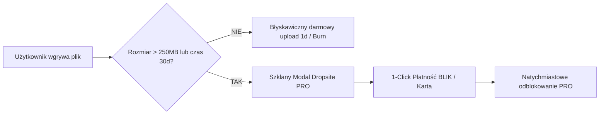
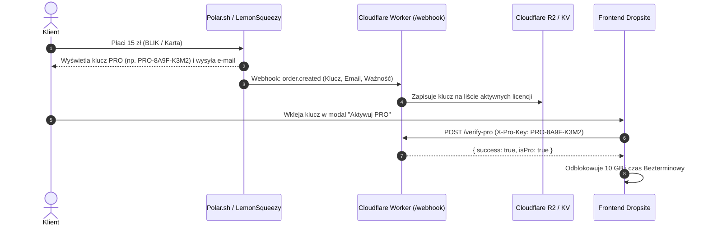
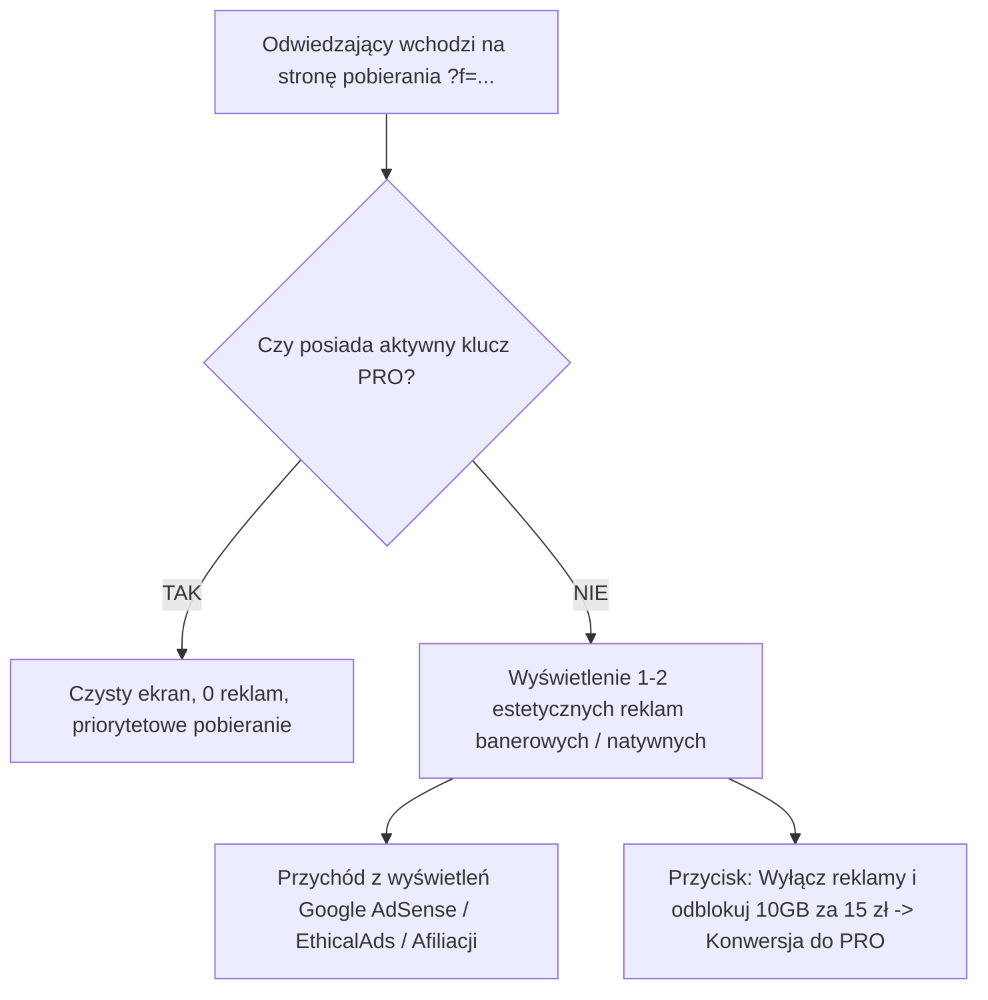

# 🚀 KOMPLEKSOWY MASTER PLAN MONETYZACJI: DROPSITE
**Projekt:** Dropsite — Prywatny i Szybki Transfer Plików (Micro-SaaS)  
**Model biznesowy:** Zero-Touch Freemium + Pay-Per-Transfer (100% zautomatyzowany)  
**Koszt stały infrastruktury:** **0 zł / miesiąc** (Cloudflare Pages + Workers + R2)  

---

## 📑 SPIS TREŚCI
1. [Etap 0: Architektura Bezpieczeństwa (Zero-Trust)](#-etap-0-architektura-bezpieczeństwa-zero-trust)
2. [Etap 1: Audyt UI/UX & Psychologia Konwersji](#-etap-1-audyt-uiux--psychologia-konwersji)
3. [Etap 2: Migracja na Cloudflare Pages (100% Legalny Hosting Komercyjny)](#-etap-2-migracja-na-cloudflare-pages)
4. [Etap 3: Wybór Bramki Płatności dla Twórcy w UE (LemonSqueezy vs Polar vs Stripe vs Easycart)](#-etap-3-bramka-płatności-dla-twórcy-w-ue)
5. [Etap 4: Zautomatyzowany Obieg Licencji PRO (Webhooks & Generowanie Kluczy)](#-etap-4-zautomatyzowany-obieg-licencji-pro)
6. [Etap 5: Monetyzacja z Wyświetleń & Reklam (Model Hybrydowy: Ads + PRO)](#-etap-5-monetyzacja-z-wyświetleń--reklam-model-hybrydowy)
7. [Etap 6: Kwestie Prawne i Podatkowe (Działalność Nierejestrowana, RODO, Regulamin)](#-etap-6-kwestie-prawne-i-podatkowe)
8. [Etap 7: Dystrybucja i Zautomatyzowany Marketing (Viral Loop)](#-etap-7-dystrybucja-i-zautomatyzowany-marketing)
9. [Etap 8: Ekonomia Jednostkowa i Prognoza Zysków](#-etap-8-ekonomia-jednostkowa-i-prognoza-zysków)

---

## 🛡️ ETAP 0: Architektura Bezpieczeństwa (Zero-Trust)

### 🛑 ETAP 0: "Zero-Trust" i Bezpieczeństwo Infrastruktury (PRIORYTET - ZREALIZOWANO ✅)
- [x] **Nowe, dedykowane konto Cloudflare**:
  - [x] Nowe konto e-mail (`dropsite33@gmail.com`) i nowe konto Cloudflare.
  - [x] Nowy bucket Cloudflare R2 (`dropsite-storage`) z włączonym publicznym dostępem.
  - [x] Nowy Worker `uploud-api` zdeployowany na `https://uploud-api.dropsite33.workers.dev`.
  - [x] Separacja środowiska od innych prywatnych domen.
* **Separacja usług:** Na ten adres załóż od zera nowe konta na Cloudflare, GitHub, Polar.sh oraz w sieciach reklamowych. Nie mieszaj ich z projektami prywatnymi.

### 2. Polityka Haseł i 2FA
* **Menedżer Haseł:** Wygeneruj do każdego z powyższych kont unikalne, losowe hasła (20-30 znaków) i zapisz w 1Password/Bitwarden.
* **MFA / 2FA (Must-Have):** Włącz uwierzytelnianie dwuskładnikowe (najlepiej TOTP przez aplikację jak Authy/Aegis lub klucz sprzętowy YubiKey) na każdym z nowo utworzonych kont.

### 3. Zabezpieczenie kodu (Environment Variables)
* Zmienna `ADMIN_SECRET` w pliku `worker.js` nie może być zapisana na sztywno w kodzie jako `12345678`.
* Należy wygenerować losowy, skomplikowany ciąg znaków i dodać go jako zmienną środowiskową (Secret) w panelu Cloudflare Workers.

### 4. Ochrona przed botami (WAF)
* Aktywuj **Bot Fight Mode** w ustawieniach Cloudflare.
* Skonfiguruj podstawowy *Rate Limiting*, by uniemożliwić masowe, złośliwe wywoływanie endpointów Workerów.

---

## 🎨 ETAP 1: Audyt UI/UX & Psychologia Konwersji

Celem tego etapu jest doprowadzenie interfejsu do stanu, w którym użytkownik **naturalnie chce zapłacić**, gdy napotka limit darmowy, a strona wzbudza 100% zaufania.



### Zadania do wykonania w UI:
1. **Punkty tarcia (Friction Points):**
   * Gdy darmowy użytkownik upuści plik o wadze np. 1.2 GB, zamiast suchego błędu wyświetlamy natychmiast elegancki modal z komunikatem:  
     *„Twój plik ma 1.2 GB. Darmowy transfer obsługuje pliki do 250 MB. Odblokuj Dropsite PRO, aby wysyłać paczki do 10 GB bez limitu prędkości!”*
2. **Karty w sekcji Cennik (`#view-cennik`):**
   * Wyróżnienie planu PRO złotą obwódką, cieniem i etykietą `NAJLEPSZY WYBÓR ✦`.
   * Przełącznik waluty (PLN / EUR / USD) zależnie od języka przeglądarki.
3. **Pasek stanu licencji (Header):**
   * Dla gościa: przycisk `✦ Dropsite PRO` z subtelną animacją błysku.
   * Dla użytkownika PRO: złota plakietka `✦ DROPSITE PRO (AKTYWNE)` dająca poczucie konta premium.
4. **Viral Banner na stronie pobierania (`?f=...`):**
   * Odbiorca pliku widzi: *„Bezpieczny plik przesłany przez Dropsite. Chcesz wysyłać własne pliki do 10 GB bez reklam? [Wypróbuj Dropsite PRO]”*.

---

## 🌐 ETAP 2: Migracja na Cloudflare Pages

Vercel Hobby zabrania projektów komercyjnych. Cloudflare Pages jest w **100% darmowy i legalny dla komercyjnego SaaS-a**.

### Dlaczego Cloudflare Pages wygrywa?
* **0 zł opłat stałych** (darmowy tier na zawsze).
* **Brak limitu transferu danych (Bandwidth).**
* Frontend i Backend (Worker + R2) działają w tej samej sieci brzegowej (0 ms opóźnień wewnętrznych).

### Instrukcja wdrożenia krok po kroku:
1. **Wypchnięcie kodu na GitHub:**
   ```bash
   git add .
   git commit -m "feat: Dropsite PRO licensing, security & Cloudflare deployment"
   git push origin main
   ```
2. **Konfiguracja Cloudflare Pages:**
   * Zaloguj się na [dash.cloudflare.com](https://dash.cloudflare.com).
   * Przejdź do: **Workers & Pages** ➔ **Create Application** ➔ zakładka **Pages**.
   * Wybierz **Connect to Git** i wskaż swoje repozytorium `dropsite`.
   * **Ustawienia buildu:**
     * Framework preset: `None`
     * Build command: *(zostaw puste)*
     * Build output directory: `.`
   * Kliknij **Save and Deploy**.
3. **Darmowy adres URL:**
   * Otrzymasz adres: `https://dropsite.pages.dev` (z darmowym certyfikatem SSL i ochroną Cloudflare DDoS w standardzie).
   * W przyszłości: w zakładce *Custom domains* możesz podpiąć własną domenę `.pl` lub `.space` za pomocą 2 kliknięć.

---

## 💳 ETAP 3: Bramka Płatności dla Twórcy w UE

Dla osób działających w Polsce i Unii Europejskiej wybór bramki to klucz do **świętego spokoju z podatkami (VAT OSS)**.

### Porównanie dostępnych rozwiązań:

| Bramka | Model | Prowizja | Rozliczanie VAT / Podatków | Obsługa BLIK | Czy opłaca się w UE? |
| :--- | :--- | :--- | :--- | :--- | :--- |
| **Polar.sh** 🏆 *(Rekomendacja #1)* | Merchant of Record (MoR) | **4% + 40¢** | **100% automatycznie** (oni są sprzedawcą) | Tak (przez Stripe backend) | **Bardzo opłacalne** (najniższa prowizja wśród MoR) |
| **LemonSqueezy** | Merchant of Record (MoR) | **5% + 50¢** (+ 1.5% za przewalutowanie) | **100% automatycznie** | Zależnie od kraju | Średnio (wyższe prowizje od czasu przejęcia przez Stripe) |
| **Paddle** | Merchant of Record (MoR) | **5% + 50¢** | **100% automatycznie** | Ograniczone | Dobre dla dużych firm, trudna weryfikacja dla solo devów |
| **Stripe Direct** | Direct Merchant | **1.5% + 1 zł** (karty UE) | **Musisz sam składać deklaracje VAT-OSS** | **Tak (natywny BLIK)** | Najniższa prowizja, ale wymaga księgowości |
| **Easycart / Naffy** | Polski Checkout / MoR | **4-5% + 1 zł** | Automatyczne faktury w PL | **Natywny BLIK, Apple Pay** | Świetne, jeśli celujesz tylko w rynek polski |

### 🎯 Rekomendacja wyboru:
* **Jeśli celujesz w rynek międzynarodowy + Polska:** Wybierz **Polar.sh**. Działa jako Merchant of Record (płacą VAT w każdym kraju za Ciebie), ma nowoczesne API, gotowy system subskrypcji oraz kluczy licencyjnych i najniższe prowizje.
* **Jeśli celujesz w 100% w rynek polski:** Wybierz **Easycart** lub **Polar.sh** (obsługa BLIK, natychmiastowa wypłata na polskie konto w PLN).

---

## 🔑 ETAP 4: Zautomatyzowany Obieg Licencji PRO

Proces zakupu i aktywacji musi działać w **100% bezobsługowo** – klient płaci o 3 w nocy, a Ty śpisz.



### Konfiguracja Webhooka w Cloudflare Worker:
1. W panelu bramki (np. Polar / LemonSqueezy) podajesz adres webhooka:  
   `https://uploud-api.yytjarus.workers.dev/webhook-payment`
2. Przy każdej udanej płatności Worker automatycznie dopisuje klucz do bazy aktywnych licencji.

---

## ⚖️ ETAP 5: Kwestie Prawne i Podatkowe

---

## 📺 ETAP 5: Monetyzacja z Wyświetleń & Reklam (Model Hybrydowy)

Dla serwisu takiego jak Dropsite **model hybrydowy (Reklamy + PRO)** to najskuteczniejsza dźwignia finansowa:
* **95% darmowych użytkowników** ogląda estetyczną reklamę na stronie pobierania ➔ **Zarabiasz na wyświetleniach (RPM/CPM).**
* **5% zaawansowanych użytkowników** płaci za PRO, aby wyłączyć reklamy i mieć 10 GB ➔ **Zarabiasz na subskrypcji.**



### 1. Rekomendowane sieci reklamowe:
1. **EthicalAds / Carbon Ads (Rekomendacja dla designu tech):**
   * Stawki: **\$2.00 – \$4.50 CPM** (ok. 8 – 18 zł za 1000 odsłon).
   * Brak ciasteczek śledzących, czyste reklamy dla programistów, projektantów i entuzjastów IT (idealnie pasuje do szklanego motywu Dropsite).
2. **Google AdSense:**
   * Stabilne wypłaty co miesiąc prosto na konto bankowe.
   * Format: elastyczny baner responsywny nad/pod przyciskiem „Pobierz plik”.
3. **Monetag / Adsterra (Wysoki eCPM dla downloadu):**
   * Stawki: **\$1.50 – \$5.00 CPM**.
   * Błyskawiczna akceptacja serwisu (w 5 minut).
4. **Afiliacja tematyczna (NordVPN / ProtonVPN / pCloud):**
   * Elegancki baner: *„Pobierasz wrażliwe pliki? Chroń swoją prywatność z ProtonVPN”*.
   * Prowizja: **80 – 160 zł za 1 zakup** wygenerowany z Twojego linku.

### 2. Szacunkowe przychody z samych wyświetleń (Kalkulator eCPM):
* Przy średnim eCPM = **\$2.00 (ok. 8 zł za 1 000 wyświetleń)**:
  * **10 000 pobrań / mc:** ~80 zł dodatkowego zysku
  * **50 000 pobrań / mc:** ~400 zł dodatkowego zysku
  * **200 000 pobrań / mc:** ~1 600 zł dodatkowego zysku
  * **1 000 000 pobrań / mc:** ~8 000 zł dodatkowego zysku

---

## ⚖️ ETAP 6: Kwestie Prawne i Podatkowe

Nie potrzebujesz od razu zakładać spółki z o.o. ani płacić drogiego ZUS-u.

### 1. Forma prowadzenia w Polsce (Działalność Nierejestrowana):
* W Polsce możesz legalnie zarabiać do **3225 zł miesięcznie (w 2026 r.)** bez rejestrowania firmy w CEIDG i bez płacenia składek ZUS.
* Rozliczasz to raz w roku w zeznaniu PIT-36 w rubryce *„Działalność nierejestrowana”*.

### 2. Magia "Merchant of Record" (MoR):
* Gdy korzystasz z **Polar.sh** lub **LemonSqueezy**, to **oni są formalnym sprzedawcą pliku/usługi dla użytkownika końcowego**.
* Ty nie wystawiasz setek faktur pojedynczym osobom fizycznym i nie rozliczasz podatków VAT w Niemczech, Francji czy USA.
* Raz w miesiącu dostajesz jeden zbiorczy przelew i jedną fakturę payoutową od Polar/LemonSqueezy.

### 3. Dokumenty na stronie:
* Wygenerowanie prostego **Regulaminu (Terms of Service)** i **Polityki Prywatności (RODO / Privacy Policy)** informującego o:
  * Automatycznym usuwaniu plików po określonym czasie.
  * Braku podglądu prywatnych plików przez administratora.
  * Zakazie przesyłania treści nielegalnych / złośliwego oprogramowania.

---

## 📣 ETAP 7: Dystrybucja i Zautomatyzowany Marketing

Nie musisz dzwonić do nikogo ani pisać wiadomości cold email. Stosujemy **Product-Led Growth (Wzrost Napędzany Produktem)**:

### 1. Pętla Wirusowa (Viral Loop) — Darmowy ruch z każdego transferu
* Każdy plik wysłany przez użytkownika trafia do 1–10 odbiorców.
* Na stronie pobierania odbiorca widzi:
  * Super szybkie pobieranie bez nachalnych reklam i captchy.
  * Wyraźny przycisk: *„Prześlij własny plik za darmo do 250 MB”* oraz *„Dropsite PRO: do 10 GB bez limitu czasu”*.

### 2. Launch na portalach dla entuzjastów technologii (Dzień 1–7):
* **Product Hunt:** Publikacja jako *„Dropsite — Ultra-fast, privacy-first temporary file transfer on Cloudflare Edge”*.
* **Reddit:** Posty na subreditach:
  * `r/InternetIsBeautiful` — pokazujący funkcję *Burn after read* i generator QR.
  * `r/selfhosted` & `r/webdev` — opis architektury Cloudflare R2 i 0 zł kosztów egressu.
  * `r/privacy` — transfer bez logowania, z hasłem i szyfrowaniem.
* **Wykop.pl:** Znalezisko w kategorii Technologia: *„Zbudowałem szybką i bezpieczną alternatywę dla WeTransfer bez reklam i śledzenia”*.

### 3. Programmatic SEO (Długoterminowy ruch organiczny z Google):
* Tworzenie prostych podstron celujących w konkretne zapytania:
  * `dropsite.pages.dev/darmowy-transfer-duzych-plikow`
  * `dropsite.pages.dev/bezpieczny-plik-z-haslem`
  * `dropsite.pages.dev/burn-after-read-file-sharing`

---

## 💰 ETAP 8: Ekonomia Jednostkowa i Prognoza Zysków

### Przykładowy miks przychodów (100 użytkowników PRO + 50 000 darmowych pobrań z reklamami):
* **Przychód z subskrypcji PRO (100 x 15 zł):** **1 500 zł / miesiąc**
* **Przychód z reklam na stronie pobierania (50 000 odsłon x \$2 CPM):** **~400 zł / miesiąc**
* **Łączny przychód brutto:** **~1 900 zł / miesiąc**

### Koszty:
* **Koszt Cloudflare R2 (1 TB danych):** ~60 zł / miesiąc
* **Prowizja bramki płatności (Polar.sh):** ~110 zł
* **Koszt Cloudflare Pages & Workers:** **0 zł**

### 💵 Twój czysty zysk pasywny:
* **Zysk netto:** `1900 zł - 60 zł - 110 zł` = **~1 730 zł / miesiąc na czysto** (Marża: **~91%**!).

---

## 📋 HARMONOGRAM WDROŻENIA (CHECKLISTA)

- [ ] **Krok 0:** Założenie dedykowanej skrzynki e-mail, konta Cloudflare i GitHuba z nałożonymi blokadami 2FA. Ukrycie `ADMIN_SECRET` w zmiennych środowiskowych Cloudflare.
- [x] **Krok 1:** Wdrożenie limitu 250 MB i blokad PRO w `worker.js`.
- [x] **Krok 2:** Dodanie modalu Dropsite PRO i weryfikacji klucza licencyjnego w `app.js`.
- [x] **Krok 3:** Dodanie odznak PRO i zaktualizowanego Cennika w `index.html`.
- [ ] **Krok 4:** Założenie konta na Cloudflare Pages i połączenie repozytorium GitHub.
- [ ] **Krok 5:** Założenie darmowego konta na **Polar.sh** i utworzenie produktu *Dropsite PRO (15 zł / mc)*.
- [ ] **Krok 6:** (Opcjonalnie) Rejestracja w sieci reklamowej (Google AdSense / EthicalAds) i dodanie slotów reklamowych dla darmowych użytkowników.
- [ ] **Krok 7:** Publikacja na Product Hunt / Reddit / Wykop i włączenie pętli wirusowej!

