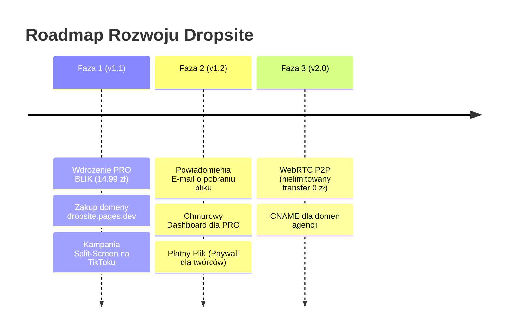
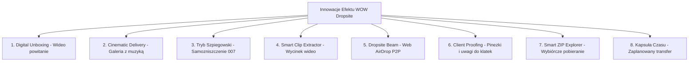

# 🚀 KOMPLEKSOWY MASTER PLAN MONETYZACJI: DROPSITE
**Projekt:** Dropsite — Prywatny i Szybki Transfer Plików (Micro-SaaS)  
**Model biznesowy:** Skoncentrowany PRO (Subskrypcje PRO / BLIK 30 Dni za 14,99 zł + Reklamy dla Free + Paywall Twórcy)  
**Koszt stały infrastruktury:** **0 zł / miesiąc** (Cloudflare Pages + Workers + R2)  

---

## 📑 SPIS TREŚCI
1. [Status Projektu & Audyt Istniejących Funkcji](#-status-projektu--audyt-istniejących-funkcji)
2. [Etap 0: Architektura Bezpieczeństwa (Zero-Trust)](#-etap-0-architektura-bezpieczeństwa-zero-trust)
3. [Etap 1: Audyt UI/UX & Psychologia Konwersji (Triggery Zakupowe)](#-etap-1-audyt-uiux--psychologia-konwersji)
4. [Etap 2: Hosting i Domena (Cloudflare Pages + Własna Domena)](#-etap-2-hosting-i-domena)
5. [Etap 3: Wdrożenie Płatności & BLIK (Architektura)](#-etap-3-wdrożenie-płatności--blik)
6. [Etap 4: Modele Monetyzacji: Dropsite PRO 14,99 zł & Paywall Twórcy](#-etap-4-modele-monetyzacji)
7. [Etap 5: Monetyzacja z Wyświetleń & Reklam (Model Hybrydowy)](#-etap-5-monetyzacja-z-wyświetleń--reklam)
8. [Etap 6: Kwestie Prawne i Podatkowe (Regulamin, RODO, Działalność Nierejestrowana)](#-etap-6-kwestie-prawne-i-podatkowe)
9. [Etap 7: Playbook Dystrybucji & Przewaga UI nad WeTransfer](#-etap-7-playbook-dystrybucji--przewaga-ui-nad-wetransfer)
10. [Etap 8: Ekonomia Jednostkowa i Prognoza Zysków](#-etap-8-ekonomia-jednostkowa-i-prognoza-zysków)
11. [Etap 9: Strategiczny Roadmap Rozwoju (Wersje v1.1 – v2.0)](#-etap-9-strategiczny-roadmap-rozwoju)
12. [Etap 10: Przełomowe Innowacje Produktowe (Efekt WOW & Przewaga nad Rynkiem)](#-etap-10-przełomowe-innowacje-produktowe)
13. [📋 Checklista Przedstartowa (Pre-Launch Checklist)](#-checklista-przedstartowa-pre-launch-checklist)

---

## 📊 STATUS PROJEKTU & AUDYT ISTNIEJĄCYCH FUNKCJI

| Element | Status | Szczegóły implementacji |
| :--- | :--- | :--- |
| **Rdzeń aplikacji (Upload/Download/Worker)** | ✅ Ukończone | Silnik R2, limity 250 MB / 10 GB, weryfikacja kluczy PRO. |
| **Branding & Złoty Favicon PRO** | ✅ Ukończone | Luksusowa złota chmura wpięta jako `favicon.ico`, `favicon.png`, `favicon.jpg` i PWA. |
| **Migracja na Cloudflare Pages** | ✅ Ukończone | 100% darmowy, komercyjny hosting bez limitu transferu. |
| **Player Multimediów (Podgląd)** | ✅ Ukończone | Wbudowany odtwarzacz wideo, audio i podgląd grafik na stronie pobierania. |
| **Pancerne Szyfrowanie (Zero-Knowledge)** | ✅ Ukończone | Klient szyfruje plik algorytmem AES-256-GCM bezpośrednio w pamięci RAM przeglądarki. |
| **Zestaw Narzędzi PDF (Toolbox)** | ✅ Ukończone | Podpis cyfrowy, scalanie, rozdzielanie, kompresja i konwersja obrazów bez wysyłania na serwer. |
| **Tryb Szpiegowski (007 Samozniszczenie)** | ✅ Ukończone | Przytrzymanie 1.5s, licznik 30s, animacja spopielenia i permanentne usunięcie z R2. |
| **Smart ZIP Explorer** | ✅ Ukończone | Podgląd struktury w RAM, wyszukiwarka plików i selektywne pobieranie z archiwum. |
| **Branding Twórcy (Signature)** | ✅ Ukończone | Pole podpisu twórcy na stronie pobierania (`Materials crafted by...`). |
| **Regulamin i Polityka Prywatności** | ✅ Ukończone | Gotowe widoki `#view-regulamin` i `#view-polityka` zaktualizowane na 01.09.2026. |
| **Płatności BLIK & Polar.sh** | ✅ Ukończone | Natywny modal BLIK (14,99 zł za 30 dni PRO), Polar.sh (14,99 zł/mc) i auto-aktywacja z kluczem licencyjnym. |
| **Oficjalna Domena (dropsite.pages.dev)** | ✅ Ukończone | Zintegrowany globalny adres Cloudflare Pages z SSL i DDoS Shield. |

---

## 🛡️ ETAP 0: Architektura Bezpieczeństwa (Zero-Trust)

### Zrealizowano:
- [x] **Dedykowane środowisko Cloudflare**:
  - Konto e-mail: `dropsite33@gmail.com`.
  - Bucket Cloudflare R2: `dropsite-storage` z publicznym dostępem.
  - Worker `uploud-api` zoptymalizowany pod kątem bezpieczeństwa (brak XSS, nagłówki bezpieczeństwa, `nosniff`).
- [x] **Separacja usług:** Nowe, odizolowane konta bez powiązań z projektami prywatnymi.

### Do dopilnowania w konfiguracji Cloudflare:
1. **Bot Fight Mode:** Aktywne w panelu Cloudflare (ochrona przed scraperami i skryptami obciążającymi serwer).
2. **Environment Secrets:** Przechowywanie kluczy administracyjnych jako zmiennych zaszyfrowanych (Secrets) w Cloudflare Worker.

---

## 🎨 ETAP 1: Audyt UI/UX & Psychologia Konwersji

### Przewaga Czystego Interfejsu:
Interfejs Dropsite bije WeTransfer na głowę:
1. **Zero zbędnych kroków:** Wejście ➔ Upuszczenie pliku ➔ Natychmiastowy link. Bez konieczności wpisywania maila i czekania na kod weryfikacyjny.
2. **Nowoczesny Glassmorphism:** Eleganckie, ciemne tło z miętowo-złotymi akcentami nie męczy oczu i buduje prestiż.
3. **Płynne przejścia:** Szklane modale, subtelne animacje mikrointerakcji.

### Komunikat Konwersji (Modal Dropsite PRO):
* Gdy darmowy użytkownik upuści plik o wadze np. **1.8 GB**:
  * **Nagłówek:** *„Ten plik ma 1.8 GB. Darmowy transfer obsługuje do 250 MB.”*
  * **Główny Call to Action (Dropsite PRO):**  
    👉 **[ ⚡ Odblokuj Dropsite PRO za 14,99 zł kodem BLIK lub kartą ]**  
    *(Transfer do 10 GB, wojskowe szyfrowanie AES-256, branding twórcy, brak reklam)*

---

## 🌐 ETAP 2: Hosting i Domena

* **Hosting:** Cloudflare Pages (darmowy, ultra-szybki globalny CDN).
* **Własna Domena:** Zakup `dropsite.pages.dev` (koszt ok. 12 zł za 1. rok). Połączenie z Cloudflare DNS gwarantuje darmowy certyfikat SSL, ochronę DDoS oraz pełną wiarygodność przed płacącymi klientami.

---

## 💳 ETAP 3: Wdrożenie Płatności & BLIK

Dla polskiego użytkownika **BLIK to metoda płatności #1**:
1. **Ścieżka Szybka (Polar.sh):** Bezobsługowe licencje i automatyczne rozliczenia VAT.
2. **Ścieżka Dedykowana (Natywny BLIK):** Klasyczny natywny BLIK (klient wpisuje 6 cyfr bezpośrednio w Dropsite) – natychmiastowe odblokowanie PRO na 30 dni za 14,99 zł.

---

## 💡 ETAP 4: Modele Monetyzacji

### 1. Dropsite PRO (14,99 PLN / miesiąc lub 30 Dni BLIK)
* **Zasada:** Brak zbierania drobnych po 2,50 zł – 15 zł to i tak bardzo niska, bezkonkurencyjna cena na rynku za pełne konto PRO.
* **Co zyskuje klient:** Transfery do 10 GB (4K wideo, archiwa), personalizowany branding twórcy na stronie pobierania, szyfrowanie AES-256 w RAM, streaming w locie, retencja do 30 dni lub permanentna, 100% brak reklam.
* **Elastyczność:** Subskrypcja z karty (Polar.sh) lub jednorazowy dostęp na 30 dni kodem BLIK bez podpinania karty.

### 3. "Płatny Plik" / Paywall Twórcy (Prowizja 5% od sprzedaży)
* Użytkownik wrzuca plik (np. presety, kurs, paczkę grafik) i ustawia cenę dla odbiorcy. Ty zarabiasz prowizję od każdej transakcji bez konieczności prowadzenia magazynu.

### 4. Wyświetlenia Reklamowe
* Czysty baner pod przyciskiem pobierania dla darmowych plików (Google AdSense / EthicalAds).

---

## 📺 ETAP 5: Monetyzacja z Wyświetleń & Reklam

* **Strona pobierania darmowego pliku (`?f=...`):**
  * Odbiorca pliku darmowego widzi 1 estetyczny baner reklamowy.
  * Stawki: **\$2.00 – \$4.50 CPM** (~8 – 18 zł za 1 000 wyświetleń).
* **Pliki przesłane przez użytkowników PRO (14,99 zł):**
  * Strona w 100% czysta, bez reklam.

---

## ⚖️ ETAP 6: Kwestie Prawne i Podatkowe

### 1. Działalność Nierejestrowana:
* Limit przychodów: do **3 225 zł / miesiąc** bez ZUS i bez rejestracji w CEIDG.
* Rozliczenie: roczny PIT-36.

### 2. Wymagane Dokumenty na stronie:
* **Regulamin Serwisu:** Zasady świadczenia usług drogą elektroniczną, zrzeczenie się 14-dniowego odstąpienia dla natychmiastowych transferów cyfrowych.
* **Polityka Prywatności:** RODO, zasady retencji plików (automatyczne usuwanie z R2 po upływie czasu).

---

## 📣 ETAP 7: Playbook Dystrybucji & Przewaga UI nad WeTransfer

Główna oś komunikacji marketingowej: **"Dropsite to WeTransfer bez zbędnego syfu i z czystym interfejsem"**.

---

### 🔥 Główny Kąt Marketingowy: "Dlaczego WeTransfer stał się nieznośny?"
> **Porównanie, które sprzedaje produkt w 5 sekund:**  
> **WeTransfer w 2026 r.:**  
> ❌ Pełnoekranowe, krzykliwe reklamy w tle,  
> ❌ Wymóg podania maila i przepisywania 6-cyfrowego kodu weryfikacyjnego,  
> ❌ Zgody na śledzenie ciasteczek,  
> ❌ Wciskanie drogiego abonamentu za 50 zł/mc.  
>  
> **Dropsite:**  
> ✅ Czysty, ciemny, szklany interfejs,  
> ✅ Zero logowania i zero czekania na maile – przeciągasz plik i masz link,  
> ✅ Wbudowany podgląd wideo/audio i edytor PDF,  
> ✅ Potrzebujesz wysłać 3–10 GB? Odblokowujesz PRO za 14,99 zł (BLIK lub karta) i masz pełne możliwości bez limitów.

---

### 🎬 60-Sekundowy Dynamiczny Trailer AI (Plan Produkcji & Prompty)

#### 🎵 Kwestia Muzyki: TikTok Trending vs Suno AI
* **Wrzutka organiczna na TikToku / Reels (Darmowy post na profilu):**  
  👉 **Możesz użyć dowolnego trendującego dźwięku / muzyki z biblioteki TikToka**. Algorytm TikToka premiuje filmy z popularnymi audio (daje dodatkowe zasięgi).
* **Płatna reklama (TikTok Ads / Meta Ads / wideo na stronie `dropsite.pages.dev`):**  
  👉 **NIE WOLNO używać komercyjnych hitów** (reklama zostanie odrzucona przez prawa autorskie). Wtedy generujesz własny podkład w **Suno AI** lub bierzesz darmowy z biblioteki *Pixabay / YouTube Audio Library*.
  * *Prompt do Suno:* `dark cyberpunk synthwave, driving distorted bassline, fast energetic tempo 135 bpm, punchy drums, tech product launch trailer, futuristic atmospheric drop, no vocals`.

---

#### ⏱️ Scenariusz Trailera Sekunda po Sekundzie (100% Kinowe CGI 3D — Bez Ludzi):

| Czas | Co widać na ekranie (Czysta animacja 3D / CGI) | Głos Lektora (ElevenLabs / AI Voice) | Dźwięk / Efekty |
| :--- | :--- | :--- | :--- |
| **0:00 - 0:08** | Ciemna cyfrowa otchłań. Czerwone, pękające szklane panele z napisem: *„STORAGE FULL / 50 PLN/MO”*, wirujące błędy, eksplozja cyfrowego szkła. | *„Przepłacasz za powolne chmury i skomplikowane formularze?”* | Głęboki basowy sub-bass, trzask pękającego szkła (*cinematic hit*). |
| **0:08 - 0:18** | **[Start ze screena Dropsite]**: Z czerni wyłania się lewitujący w 3D szklany interfejs ze screena. Kamera przelatuje nad szlifowanymi krawędziami szkła i pulsującym złotym symbolem chmury. | *„Oto Dropsite. Czysty, bezkompromisowy transfer nowej generacji.”* | Potężny cyberpunkowy drop (*whoosh + synth pulse*). |
| **0:18 - 0:30** | Świecąca kula danych (plik 5 GB) wpada w szklany portal ➔ Wokół niej materializuje się szmaragdowa, kryształowa tarcza AES-256 z kodami binarnymi. | *„Zero spamu. Szyfrowanie wojskowe AES-256. Prędkość ograniczona tylko Twoim łączem.”* | Dźwięk ładowania reaktora / lasera, mechaniczny zatrzask tarczy. |
| **0:30 - 0:42** | Ekran odbiorcy: z kuli danych w ułamku sekundy rozwija się holograficzny odtwarzacz wideo 4K z podglądem w locie. | *„Natychmiastowy podgląd wideo i audio bez konieczności pobierania gigabajtów.”* | Krystaliczny dźwięk aktywacji hologramu (*chime*). |
| **0:42 - 0:52** | Wokół kryształu danych zapalają się złote pierścienie energii z pulsującym symbolem „DROPSITE PRO 14,99 PLN” ➔ Eksplozja złotych cząsteczek. | *„Odblokuj pełne konto PRO za 14,99 zł. Błyskawiczny BLIK lub karta.”* | Złoty rezonans dźwiękowy, głęboki basowy impuls. |
| **0:52 - 1:00** | Luksusowy złoty monolit ze szklanym logo Dropsite, adres `dropsite.pages.dev` jarzący się na ciemnym obsydianie. | *„Dropsite. Po prostu upuść plik.”* | Wygasający kinowy akord smyczkowy z syntetykiem. |

---

#### 🤖 Gotowe Prompty Kinowe 3D (Bez Ludzi / Octane Render Style)

* **Scena 1 (Część 1: 0:00 - 0:30) — Start ze zrzutu ekranu Dropsite:**
  * *Tryb:* Image-to-Video (wgrywasz screen strony głównej Dropsite).
  * *Prompt do skopiowania:* `Cinematic 3D CGI product reveal, strictly NO humans. Starting from this dark frosted glass web interface, camera executes an IMAX-style sweeping orbit around floating glass panels with photorealistic obsidian reflections. Glowing neon mint and gold UI circuits pulse with energy. Floating ambient volumetric micro-particles, anamorphic blue and amber lens flare, futuristic science fiction tech commercial, Unreal Engine 5 cinematic render, Raytracing, 8k ultra detail, 60fps.`
* **Scena 2 (Część 2: 0:30 - 1:00) — Finał z BLIKiem i Złotym Logo:**
  * *Prompt do skopiowania:* `Cinematic CGI sequence, NO humans. A massive glowing 5GB holographic data sphere surrounded by an emerald green crystal force field of AES-256 binary streams. Three concentric rings of liquid gold energy with glowing neon digits 'PRO 14.99 PLN' rotate and lock into place with a radiant gold burst. Final shot: iconic obsidian glass black cube with radiant glowing golden cloud logo floating in void. Cinematic Hollywood movie trailer aesthetic, photorealistic 8k, Octane Render.`

---

### 💬 Post na Wykop.pl i Grupy Montażystów / Fotografów:
```text
Tytuł: Zrobiłem minimalistyczną alternatywę dla WeTransfer – bez pełnoekranowych reklam i bez kodów na maila

Cześć! Też irytuje Was, że żeby wysłać komuś jeden plik przez WeTransfer, musicie podawać swój e-mail, czekać na kod weryfikacyjny, przeklikiwać zgody marketingowe i oglądać wielkie banery reklamowe w tle?

Postanowiłem stworzyć Dropsite z myślą o prostocie:
- Czysty, intuicyjny interfejs bez śmieci i zbędnych kroków.
- Przeciągasz plik -> dostajesz natychmiastowy link.
- Wbudowany podgląd wideo i audio (odbiorca może sprawdzić materiał bez pobierania całego gigabajta).
- A jak ktoś potrzebuje przesyłać potężne pliki do 10 GB: pełne konto PRO za jedyne 14,99 zł (wygodny BLIK na 30 dni lub subskrypcja) bez wciskania drogich zagranicznych abonamentów za 50 zł.

Link do testów: [dropsite.pages.dev]
Dajcie znać jak oceniacie prostotę i prędkość!
```

---

## 💰 ETAP 8: Ekonomia Jednostkowa i Prognoza Zysków

### Scenariusz Realistyczny (Skoncentrowany na PRO 14,99 zł):
* **80 kont PRO (subskrypcje + 30-dniowe doładowania BLIK: 80 x 14,99 zł):** **~1 200 zł**
* **25 000 darmowych pobrań z reklamami (eCPM $2.00):** **~200 zł**
* **Łączny przychód:** **~1 400 zł / miesiąc**

### Koszty stałe:
* Cloudflare (Pages, Workers, R2): **~20 zł**
* Prowizje bramek płatności: **~90 zł**
* **Czysty zysk netto:** **~1 190 zł / miesiąc (Marża: >91%)**

---

## 🗺️ ETAP 9: Strategiczny Roadmap Rozwoju

Rozwój serwisu podzielony na konkretne etapy produktowe:



### Faza 1 (v1.1) — Start i Monetyzacja
1. Podpięcie natywnego BLIKa (14,99 zł za 30 dni PRO) + Polar.sh (14,99 zł/mc subskrypcja z karty).
2. Zakup i wpięcie domeny `dropsite.pages.dev`.
3. Start kampanii porównawczej "Dropsite vs WeTransfer: Czysty UX".

### Faza 2 (v1.2) — Narzędzie dla Twórców & E-Commerce
1. **Powiadomienia E-mail o pobraniu:** Nadawca opcjonalnie podaje mail i otrzymuje informację, w sekundzie gdy odbiorca ściągnie plik.
2. **Chmurowy Manager Plików:** Zalogowany użytkownik PRO zarządza wszystkimi aktywnymi linkami w jednym pulpicie (usuwanie, przedłużanie, zmiana haseł).
3. **Paywall dla Twórców:** Możliwość ustawienia ceny za pobranie pliku (sprzedaż presetów, grafik, e-booków).

### Faza 3 (v2.0) — Skalowanie bez Kosztów
1. **WebRTC P2P Transfer:** Bezpośredni przesył przeglądarka-przeglądarka dla paczek 20–50 GB (zero obciążenia serwera R2).
2. **Własna domena dla agencji (CNAME):** Agencja może podpiąć `transfer.agencja.pl` i wysyłać pliki pod własnym adresem.

---

## ⚡ ETAP 10: Przełomowe Innowacje Produktowe (Efekt WOW & Przewaga nad Rynkiem)

Unikalne funkcje, które deklasują konkurencję i wywołują u użytkowników efekt „zbierania szczęki z podłogi”:



### 1. 🎬 „Digital Unboxing” (Wideo lub Głosowe Powitanie od Nadawcy)
* **Mechanika:** Podczas wgrywania pliku, nadawca jednym kliknięciem nagrywa 15-sekundowe wideo z kamerki lub notatkę głosową.
* **Doświadczenie odbiorcy:** Po otwarciu linku na szklanym panelu pojawia się pulsujący, zaokrąglony avatar z nagraniem nadawcy (np. montażysta tłumaczy klientowi, na co zwrócić uwagę w pliku).
* **Zastosowanie:** Agencje reklamowe, fotografowie, montażyści, a także zwykli ludzie wysyłający życzenia wideo wraz z prezentem.

### 2. 🎵 „Cinematic Delivery” (Klimatyczna Galeria z Muzyką dla Fotografów)
* **Mechanika:** Przy wysyłce paczki zdjęć nadawca włącza „Tryb Prezentacji” i wybiera nastrojowy podkład muzyczny (np. lofi beat lub łagodny fortepian).
* **Doświadczenie odbiorcy:** Zdjęcia wyświetlają się w pełnoekranowym, kinowym pokazie slajdów na ciemnym szkle z płynną muzyką. Na końcu pojawia się przycisk pobrania całej paczki.
* **Dlaczego to sprzedaje PRO:** Fotografowie sesji ślubnych i biznesowych chętnie płacą abonament, bo ich oddanie materiałów wygląda 100x bardziej prestiżowo niż surowy ZIP.

### 3. 🕵️‍♂️ „Tryb Szpiegowski (Mission: Impossible)” — TikTok Viral Engine
* **Mechanika:** Przełącznik dla ultra-poufnych plików (hasła, skany dokumentów, poufne umowy).
* **Doświadczenie odbiorcy:** Ekran jest zamazany. Odbiorca musi **przytrzymać palec/myszkę**, aby odsłonić treść. W rogu ekranu tyka licznik: *„Plik ulegnie samozniszczeniu za 10... 9... 8...”*. Po upływie czasu animacja dymu usuwa plik na zawsze z serwera.
* **Marketing:** Gotowy temat na wirusowe wideo: *„Jak wysyłać poufne pliki jak agent wywiadu?”*.

### 4. ✂️ „Smart Video Scrub & Clip Extractor”
* **Mechanika:** Odbiorca 5-gigabajtowej surówki wideo nie musi pobierać całego pliku. Na osi czasu wbudowanego playera zaznacza interesujące go 15 sekund i pobiera **tylko ten fragment** (kilkanaście megabajtów wyrenderowanych w locie w przeglądarce).

### 5. 📡 „Dropsite Beam / Web AirDrop” (Transfer Lokalny bez Internetu)
* **Mechanika:** Parowanie urządzeń (np. iPhone i laptop z Windows) 4-cyfrowym kodem PIN lub lokalną siecią Wi-Fi.
* **Zaleta:** Przesyłanie paczek 50 GB z telefonu na komputer bez zużywania transferu internetowego, bezpośrednio z prędkością sieci lokalnej (300–500 Mb/s).

### 6. ✍️ „Client Proofing & Revision Pins” (Mini-Frame.io dla Twórców)
* **Mechanika:** Klient przeglądający wideo lub grafikę na stronie pobierania może kliknąć w dowolny punkt ekranu i dodać pinezkę: *„Zmień ten napis na żółty”* lub *„Przytnij to ujęcie o 1 sekundę”*.
* **Wartość:** Eliminuje potrzebę drogich narzędzi do feedbacku (jak Frame.io kosztujące $15/mc).

### 7. 📦 „Smart ZIP Explorer & Selective Download”
* **Mechanika:** Gdy ktoś wysyła archiwum ZIP z 300 plikami (np. 2 GB), odbiorca widzi drzewo katalogów i może pobrać **tylko jeden wybrany plik** bez konieczności ściągania i rozpakowywania całego archiwum.

### 8. ⏳ „Kapsuła Czasu (Zaplanowany Transfer)”
* **Mechanika:** Możliwość ustawienia daty aktywacji linku (np. *„Aktywuj ten transfer w Wigilię o 18:00”* lub *„Wyślij życzenia urodzinowe za 3 miesiące”*).

---

## 📋 CHECKLISTA PRZEDSTARTOWA (PRE-LAUNCH CHECKLIST)

### Faza 1: Fundamenty Techniczne & UI
- [x] Backend Cloudflare Worker (`uploud-api`) z limitami 250 MB / 10 GB.
- [x] Szklany interfejs, modal PRO i weryfikacja kluczy w `app.js`.
- [x] Luksusowy złoty favicon na obsydianowym szkle (`favicon.jpg`).
- [x] Migracja frontendu na **Cloudflare Pages** (darmowy komercyjny hosting).
- [x] Regulamin i Polityka Prywatności w widokach serwisu.

### Faza 2: Płatności & Zaufanie
- [x] Wdrożenie płatności natywnym BLIKiem (14,99 zł za 30 dni PRO) z walidacją 6 cyfr i autoryzacją.
- [x] Podpięcie linków zakupu (Stripe BLIK 14,99 zł i Polar.sh 14,99 zł/mc).
- [x] Automatyczna aktywacja licencji PRO po powrocie z bramki płatności.
- [x] Podpięcie domeny `dropsite.pages.dev` w Cloudflare Pages.

### Faza 3: Dystrybucja & Start
- [ ] Opublikowanie porównania WeTransfer vs Dropsite (Wideo / Post).
- [ ] Publikacja postu na Wykop.pl i branżowych grupach FB.
- [ ] Nagranie virału na TikToka z "Trybem Szpiegowskim 007".
